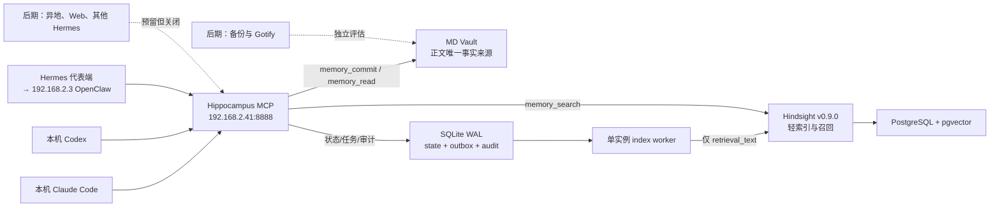

# Pi5 记忆中枢（Hippocampus）最终实施计划 v4 — 总纲

> 日期：2026-08-08
> 状态：final v4（三次复核收敛、拆分版），尚未实施
> 署名：Claude
> 部署目标：Pi5（`kkp@192.168.2.41`）Docker
> 索引引擎基线：Hindsight `v0.9.0`
> 一期范围：Phase 0–2
> 一期代表客户端：本机 Claude Code、本机 Codex、一台 Hermes 代表端（指向 `192.168.2.3` OpenClaw）

## 0.1 文档地位与结构

本目录（`/Users/magnetic/hippocampus/plan/`）是 Hippocampus 的**唯一实施依据**。v4 由 [v3](/Users/magnetic/claudeWorkspace/hippocampus-pi5-final-implementation-plan-v3-2026-08-08.md) 三次复核收敛并按域拆分而成；v1–v3、综合定稿与调研报告降级为历史背景材料，冲突时以本目录 v4 为准。

| 文档 | 内容 |
|---|---|
| [01-scope-boundaries.md](01-scope-boundaries.md) | 统一口径、永久秘密红线、一期硬排除、`.2.41` Gateway 排除、允许变更面与停止条件 |
| [02-architecture.md](02-architecture.md) | 最终架构、责任矩阵、故障降级语义 |
| [03-data-model.md](03-data-model.md) | Bank/标签、稳定 URI、Markdown 结构、retain 载荷 |
| [04-security.md](04-security.md) | 服务端扫描、拒绝语义、外部修改、secret plane、client registry、LAN HTTP 风险 |
| [05-outbox-worker.md](05-outbox-worker.md) | SQLite 边界、主写链路状态机、startup recovery、单实例 worker、status 映射 |
| [06-deployment.md](06-deployment.md) | 服务与端口、Compose 依赖、镜像 digest、Hindsight 配置、资源上限 |
| [07-mcp-tools-audit.md](07-mcp-tools-audit.md) | 四个 MCP 工具契约、操作审计日志 |
| [08-phases.md](08-phases.md) | Phase 0–4 分阶段实施 |
| [09-acceptance-gonogo.md](09-acceptance-gonogo.md) | 一期验收与故障注入、Go / No-Go |
| [10-rollback-deliverables.md](10-rollback-deliverables.md) | 回滚原则、实施交付物、参考资料 |

## 0.2 v4 相对 v3 的复核收敛

v4 保留 v3 全部裁决（C1–C15：`event_at` 独立时间语义、REST `items[]+async=false`、full hash 不出 SQLite、audit gate fail-closed 且经 `root_request_id/event_id` 关联重试、UUIDv4 幂等键与全参数扫描、`--env-file` 仅插值、Hindsight LLM/OTEL trace 与 4xx dump 旁路关闭、四工具统一授权+后置校验、正文 chunking 永久边界、幂等仅限同 key 同 payload、不新建主机账户、LAN HTTP 风险显式处理、`event_at` 卡片只取安全 metadata 原值、Docker socket/group/ACL 管理面核验、认证后先插最小 audit 行再校验），并做以下修订：

| # | v3 问题 | v4 修订 |
|---|---|---|
| D1 | retain 载荷把字符串 `"unset"` 作为 `timestamp` 发送 | 无可靠 `event_at` 时**省略 `timestamp` 字段**，不发送任何哨兵字符串。Hindsight 时间解析脆弱（[#3250](https://github.com/vectorize-io/hindsight/issues/3250)、[#3217](https://github.com/vectorize-io/hindsight/issues/3217) 同类风险），非 ISO 哨兵可能被错误解析或拒绝。frontmatter 内部仍用 `event_at: unset`（[03](03-data-model.md)、[05](05-outbox-worker.md)） |
| D2 | Phase 0 本机工作区固定 `/Users/magnetic/piWorkSpace/hippocampus/`，与用户指定目录不一致 | Mac 侧项目根统一为 `/Users/magnetic/hippocampus/`：`plan/`（本计划）、`phase0/`（隔离验证工作区）；disposable Compose 前缀 `hippocampus-phase0-` 不变（[08](08-phases.md)） |
| D3 | Go/No-Go 引用 `OTEL_TRACES=false`，但配置模板未包含任何 telemetry 关闭项 | 配置模板补 telemetry/exporter 关闭项；确切变量名（OTEL/trace 相关）由 Phase 0 对 v0.9.0 源码核对后固定，验收与 Go/No-Go 对应（[06](06-deployment.md)、[09](09-acceptance-gonogo.md)） |
| D4 | v3 文档在 §13 交付物清单中途截断，缺 backups-test、secret plane 交付、附加交付物与参考资料 | [10](10-rollback-deliverables.md) 补全 |
| D5 | 单文档 800 行难以按域执行与维护 | 按用户要求拆分为总纲 + 10 个细节文档，统一署名与交叉链接 |
| D6 | 跨项目通用知识（用户偏好、通用约定）无归属约定 | 保留 project 名 `global`（Vault 路径 `shared/global/`），三客户端 `allowed_projects` 默认包含 `global`（[03](03-data-model.md)、[04](04-security.md)） |

## 0.3 核心原则（一句话版）

> Hindsight 中只保存可检索的轻量索引（retrieval_text + 索引卡 metadata）；完整正文只存 MD Vault；所有 Agent 只经 Hippocampus MCP 访问；写入主链同步落盘、副链经 Outbox 异步索引；秘密材料在所有路径上 fail-closed 零落盘；每次工具调用有且仅有一条脱敏审计。

## 0.4 架构速览

## 0.5 版本沿革

| 版本 | 要点 |
|---|---|
| 调研 + 综合定稿（2026-08-08） | 可行性 9/10；三层架构（Hindsight 轻索引 / MD Vault / 统一 MCP）；秘密红线；单 Bank `main` |
| final v1 | prepared/ready 状态机、禁正文 chunking、状态不回写 MD、MCP 与 Hindsight 解耦、at-least-once、startup recovery、Token 环境变量化、Phase 0 离线 |
| v2（Claude 复核） | 补操作审计条款；`tag_groups` strict 过滤陷阱；retain 补时间维度；`detail_body` 可选；`--env-file` 机制化；env 候选模板合并；chunking 裁决显式化 |
| v3（二次复核） | `event_at` 独立时间语义；`items[]+async=false`；full hash 边界；audit gate 闭环；全参数扫描限型；trace 旁路关闭；统一授权后置校验；chunking 永久边界；LAN HTTP 风险条款 |
| **v4（本版，Claude 三次复核 + 拆分）** | D1–D6：timestamp 省略语义、Mac 路径统一、telemetry 关闭补全、交付物补全、按域拆分、`global` project 约定 |

## 0.6 Go / No-Go 摘要

完整判据见 [09-acceptance-gonogo.md](09-acceptance-gonogo.md)。任一失败即 No-Go；不得以「Agent 直连 Hindsight MCP」「先保存正文再补安全控制」「临时共享 Token」替代。

---

*署名：Claude — 2026-08-08，基于 v1–v3 与 Hindsight v0.9.0 源码复核收敛。*
