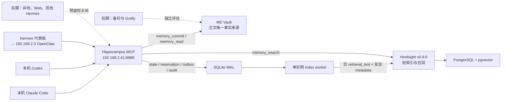

# Pi5 记忆中枢（Hippocampus）最终实施计划 v4.1 — 独立修订总纲

> 日期：2026-08-08  
> 状态：final v4.1（v4 复核修订、独立版本集），尚未实施  
> 来源：Claude v4；修订：Codex  
> 部署目标：Pi5（`kkp@192.168.2.41`）Docker  
> 索引引擎基线：Hindsight `v0.9.0`  
> 一期范围：Phase 0–2  
> 一期代表客户端：本机 Claude Code、本机 Codex、一台 Hermes 代表端（指向 `192.168.2.3` OpenClaw）

## 0.1 文档地位与原子版本边界

本目录（`/Users/magnetic/hippocampus/plan/v4.1-revised-2026-08-08/`）是一个**独立、自包含、不可跨版本拼接**的实施版本集。实施、验收与回滚必须使用本目录内同一版本的 00–10 全部文档，并先校验同目录 `MANIFEST.sha256`；不得拿父目录 v4 的某个细分项替换本版同名文件。所有 Phase 0 派生物固定进入版本化根并记录 manifest digest，不能复用旧版本产物。

父目录原 v4、[v3](/Users/magnetic/claudeWorkspace/hippocampus-pi5-final-implementation-plan-v3-2026-08-08.md) 与更早材料均原样保留，仅用于历史追溯；发生冲突时以本 v4.1 版本集为准。本轮没有修改 Pi5、`.2.3` OpenClaw、客户端配置或任何现有服务。

| 文档 | 内容 |
|---|---|
| [01-scope-boundaries.md](01-scope-boundaries.md) | 统一口径、永久秘密红线、一期硬排除、允许变更面与停止条件 |
| [02-architecture.md](02-architecture.md) | 最终架构、责任矩阵、统一故障降级语义 |
| [03-data-model.md](03-data-model.md) | Bank/project/标签、稳定 URI、Markdown 与 retain 载荷 |
| [04-security.md](04-security.md) | ingress、扫描、secret plane、Docker 管理面、registry 与 LAN HTTP |
| [05-outbox-worker.md](05-outbox-worker.md) | reservation、Outbox 状态机、fsync、恢复、worker 与 status |
| [06-deployment.md](06-deployment.md) | Compose inventory、网络/挂载/加固、镜像、Hindsight 配置与资源 |
| [07-mcp-tools-audit.md](07-mcp-tools-audit.md) | JSON-RPC ingress、四工具契约、召回归并与操作审计 |
| [08-phases.md](08-phases.md) | Phase 0–4、commissioning 与三个真实代表客户端 |
| [09-acceptance-gonogo.md](09-acceptance-gonogo.md) | 验收、故障注入、commissioning 与 Go / No-Go |
| [10-rollback-deliverables.md](10-rollback-deliverables.md) | 精确回滚、安全备份、实施交付物与依据 |

## 0.2 v4.1 复核收敛

v4.1 保留 v4 的拆分结构、Mac 项目根 `/Users/magnetic/hippocampus/`、完整交付物与 `global` project 入口，同时修正以下问题：

| # | v4 问题 | v4.1 裁决 |
|---|---|---|
| R1 | 把无时间事实的 `timestamp` 省略 | Hindsight v0.9.0 对省略值默认 `utcnow()`；无可靠时间必须显式发送 `"unset"`，可靠时间发送规范化 RFC 3339 |
| R2 | 卡片要求 metadata `event_at`，retain 却未保存 | metadata 固定保存 RFC 3339 或 `unset` 字符串；卡片只取该值，不借用 Hindsight 推断时间 |
| R3 | 幂等先生成 ID/时间，再用完整文件 hash 比较 | 业务扫描后、文件操作前建立 reservation；用独立 key 的规范化 payload HMAC 判定同 key 重放，固定 event/document/URI/时间 |
| R4 | Outbox/audit 声称 root/event 关联但 schema 缺字段 | 明确 `1 event : N audit requests`、FK/唯一约束、`root_request_id/event_id` 和 worker `event_id+attempt` 关联 |
| R5 | prepared 前未 fsync staging 目录项 | 相邻 staging 文件执行 `fsync(file) → fsync(parent) → prepared`，rename 后再次 fsync parent；补断电缺失状态 |
| R6 | 扫描器故障在细分项中一边放行 read/status、一边四工具全停 | 统一为四个数据工具、worker、retry、recovery 全部 fail-closed；仅健康端点报告故障 |
| R7 | JSON-RPC canary 只有验收、没有 ingress 合同 | 禁 batch/压缩/未知 Content-Type，限制大小与嵌套；原始 method/id/name/未知键不落盘、不回显，审计只写固定枚举 |
| R8 | audit 终态更新失败仅覆盖 commit | search/read/status 丢弃结果并报 audit unavailable；commit 如实返回 recovery_pending，任何普通成功都在终态 audit 提交后 |
| R9 | 非秘密 env、OTEL 与 Control Plane 仍有实施歧义 | 强制挂接 `hindsight.env`；固定 `HINDSIGHT_API_OTEL_TRACES_ENABLED=false`、`HINDSIGHT_ENABLE_CP=false`，9999 内外均不监听 |
| R10 | Docker 管理面与 Compose 对象只在事后验收 | 启动前核验 socket/group/context/daemon；固定 project/network/volume/mount/health/hardening inventory，不挂 Docker 管理面 |
| R11 | LAN source allowlist 在发布端口后才启用，且未绑定 client | Phase 0/2 只读形成候选；启动前加载所有已启用 client 精确地址的并集 gate，认证后再按 registry 的 client→peer 绑定复核；禁止网段/通配/自动放行 |
| R12 | Hindsight 一文档可返回多 fact，却直接裁 5 条 | 全部校验后按 `document_id` 归并；metadata 冲突整组丢弃；按组最高分排序，最多返回 5 个唯一文档卡片 |
| R13 | Token 撤销/轮换没有可执行管理面 | 增加非 MCP registry CLI；秘密只经 stdin/0600 文件，按 client_id 可撤销，禁止 argv/stdout |
| R14 | 客户端备份可能把既有秘密或其指纹带入项目 | 备份本体留在各客户端原安全域或独立 0700/0600 非 Git 目录；交付物只记安全备份 ID、路径、时间、权限和回滚结果，不记正文、diff、摘要或大小 |
| R15 | Go 前又要求真实三端写入，且测试数据会污染正式 Bank | 增设仅合成数据的隔离 Bank `commissioning-v4-1`；三端真实 E2E 后移除权限、轮换 Token 并切到空 `main`，再允许正式记忆 |
| R16 | OpenClaw 配置生效可能需要未授权重启 | 先验证热加载；若必须重启 `.2.3` OpenClaw，Phase 2 停在能力报告并另行授权 |
| R17 | 回滚“验证 Gateway 无变化”可能诱导越界探测 | 仅以 Hippocampus 变更清单、配置引用和流量目标记录证明未参与；永不直接检查 Gateway |
| R18 | `global` 默认权限含义过宽 | `readable_projects/writable_projects` 分离；`global` 必须显式授权、显式查询，不自动并入其他 project |
| R19 | Phase 0 共享目录可能混入旧版本产物 | 固定版本化 Phase 0 根、独立 Compose 前缀与 `MANIFEST.sha256`；来源 digest 不符或出现未知产物即停止 |

R1 依据 Hindsight v0.9.0 的 [HTTP schema](https://github.com/vectorize-io/hindsight/blob/v0.9.0/hindsight-api-slim/hindsight_api/api/http.py) 与 [retain orchestrator](https://github.com/vectorize-io/hindsight/blob/v0.9.0/hindsight-api-slim/hindsight_api/engine/retain/orchestrator.py)：省略 timestamp 会默认当前时间，特殊值 `unset` 才显式生成无时间事实。R9 的确切 OTEL 开关来自同版本 [config.py](https://github.com/vectorize-io/hindsight/blob/v0.9.0/hindsight-api-slim/hindsight_api/config.py)。

## 0.3 核心原则

> Hindsight 只保存可重建的轻量索引（retrieval_text + 安全索引 metadata）；完整正文只存 MD Vault；所有 Agent 只经 Hippocampus MCP 访问；写入主链同步落盘、副链经 Outbox 异步索引；秘密材料在所有路径上 fail-closed 零落盘；每个已认证 MCP HTTP 请求（含生命周期、拒绝和错误）有且仅有一条脱敏审计；任何普通成功响应都必须先完成终态审计。

## 0.4 架构速览

## 0.5 版本沿革

| 版本 | 要点 |
|---|---|
| v1–v3 | 三层架构、prepared/ready、正文不进 Hindsight、统一 MCP、秘密红线、审计/幂等/时间与 LAN 风险闭环 |
| v4（父目录原版） | 改为总纲 + 10 个细分项，统一 Mac 路径，补交付物与 `global` project；但拆分时出现跨文档回退与新增语义错误 |
| **v4.1（本目录）** | R1–R19：恢复并强化安全/一致性闭环，固定 Compose、commissioning 与版本化派生物合同，形成新的独立版本集 |

## 0.6 Go / No-Go 摘要

完整判据见 [09-acceptance-gonogo.md](09-acceptance-gonogo.md)。任一失败即 No-Go；不得以 Agent 直连 Hindsight MCP、先保存正文再补安全控制、临时共享 Token、通配 source allowlist 或 curl 替代真实三客户端 E2E。

---

*修订：Codex — 2026-08-08。*
