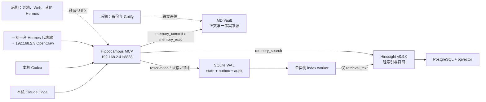

# 02 · 最终架构（v4.2）

> 属于 [Hippocampus 实施计划 v4.2](00-overview-v4.md) · final · 2026-08-08

## 2.1 架构图

## 2.2 责任矩阵

| 能力 | Hippocampus MCP | MD Vault | Hindsight |
|---|---|---|---|
| Agent 认证与权限 | 主责 | 无 | 仅内部 Token |
| 秘密扫描与拒绝 | 主责，最终控制 | 只接收通过内容 | 防御纵深 |
| 完整正文保存 | 编排 | 唯一事实来源 | 禁止 |
| 语义检索与排序 | 调用、过滤、裁剪 | 无 | 主责 |
| `memory://` 路径解析 | 主责 | 被受控读取 | 只保存逻辑 URI |
| 写入幂等和状态 | 主责 | 保存稳定文档 | 稳定 `document_id` upsert |
| 操作审计 | 主责（audit 表） | 无 | 无 |
| 数据重建 | 编排 | 重建源 | 可清空后重建 |

**一期重建边界（已接受残余风险）**：「可清空后重建」描述的是数据关系，不是一期操作能力——批量重建工具 `memory_reindex/memory_reconcile` 属 Phase 3 另行授权。一期内若 Hindsight/PostgreSQL 数据丢失，Vault 正文与 SQLite state 完整保留，`memory_commit/read/status` 不受影响，但存量文档的批量补索引须先取得 Phase 3 授权；该窗口内 `memory_search` 按 §2.3 返回 `HIPPOCAMPUS_INDEX_UNAVAILABLE`。重建能力本身在 Phase 0 disposable 环境验证（[09 §10.1](09-acceptance-gonogo.md)）。

Hindsight standalone 镜像的一期 Control Plane 必须以 `HINDSIGHT_ENABLE_CP=false` 完全禁用，不属于架构节点；Hindsight 原生 MCP 同样关闭。Agent 只能到达 Hippocampus MCP。

## 2.3 故障降级语义

| 故障 | `memory_commit` | `memory_read` | `memory_search` | `memory_status` |
|---|---|---|---|---|
| Hindsight/PostgreSQL 不可用 | 继续写 Vault，返回 `index_pending` | 已知安全 URI 可读 | `HIPPOCAMPUS_INDEX_UNAVAILABLE` | 可用，显示积压 |
| 秘密扫描器不可用 | 拒绝，零写入 | 拒绝，不读 Vault | 拒绝，不访问 Hindsight | 拒绝；只保留 `/healthz`、`/readyz`、`/version` |
| SQLite/audit/registry 不可用 | 拒绝，零文件写入 | 拒绝，无法确认授权与最新安全状态 | 拒绝，无法确认授权和结果状态 | 拒绝；只保留 `/healthz`、`/readyz`、`/version` |
| Vault 不可用 | 拒绝写入 | 不可读 | 可返回卡片但标明正文不可用 | 可用 |

扫描器不可用时 worker、retry、dead replay 与 startup recovery 也全部暂停。记忆服务任何故障都不得阻塞 Agent 完成当前用户任务；Agent 应跳过记忆步骤继续当前任务。

审计 insert 失败视同 SQLite 故障，四个数据工具不得继续业务解析、读取、写入或调用 Hindsight。终态 audit update 失败时，search/read/status 丢弃结果并返回 `HIPPOCAMPUS_AUDIT_UNAVAILABLE`；commit 按真实持久化状态返回带安全错误码的 `recovery_pending`，不得声称未发生或返回普通成功。

---

*v4.2 final*
